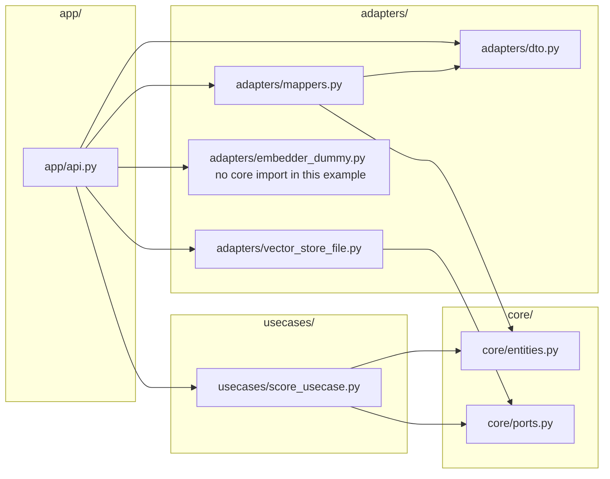
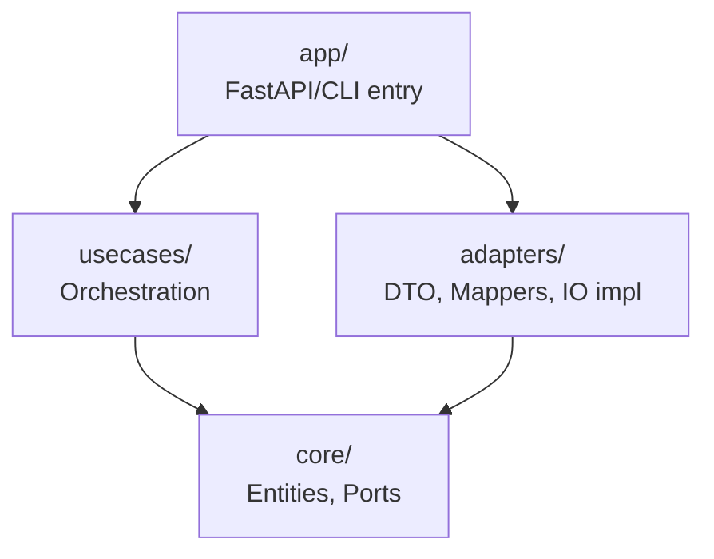

#### 짧은 회고
다시 돌아왔음. 
이 환경에 블로그를 세팅한 것이 벌써 1년이 다 되어감... 돌아보니 꽤 괜찮았음.

그동안 글을 어떻게 작성할지 고민이었는데,  
편하게 쓰고자 하니, 너무 쓸데없는 말들이 많았고  
형식과 내용을 생각하면, 손이 안갔다.

포스팅 같은 것을 거의 보지 않다가, 근래에 조금씩 보기 시작했고 역시나 모방은 좋은 시작인듯 싶다. 

---

# 코딩 (AI)
"데이터"
-> 어떻게 관리할 것인지
	-> 언제 어떻게 얼만큼 저장할 것인가
	-> 어떻게 처리할 것인가

수집 - 저장 - 처리 - 기록

<br>

## 1) 규칙

1. **파이프라인은 “데이터”가 흐르고, 코드는 “조립”만 한다**
    

- 각 단계는 _입력/출력_이 명확한 “함수(혹은 컴포넌트)”로.
    
- 조립(오케스트레이션)은 얇게: `pipeline.py`는 연결만 하고, 로직은 컴포넌트에.
    

2. **Side effect(파일 저장/DB/네트워크)를 가장자리로 밀기**
    

- 핵심 로직은 “순수 함수”에 가깝게.
    
- 저장/로그/업로드는 마지막 레이어(어댑터)에서.
    

3. **실험(연구) 코드와 제품(운영) 코드를 분리하되, 연결 통로를 만든다**
    

- `notebooks/`는 자유롭게, 하지만 “재현 가능한 run”은 `src/`에서만 실행되게.
    
- 노트북은 결국 `src`의 함수를 호출하는 쪽으로 수렴시키기.
    

4. **모든 실행(run)은 ID를 갖고, 그 ID로 전부 연결된다**
    

- 데이터 버전, 파라미터, 코드 버전, 결과물(모델/리포트)을 “하나의 run”으로 묶기.
    
- MLflow든, 단순 폴더 구조든 일관된 run-id가 핵심.
    

5. **“변경이 잦은 것”을 바깥으로 빼라**
    

- 설정(config), 프롬프트, 임계값, 모델 이름, 경로… 이런 건 코드에 박지 말고 config로.


## 2) 체크리스트

- **한 단계(컴포넌트)는 한 가지 일만**: preprocess / embed / retrieve / rerank / generate / evaluate…
    
- **입출력 타입을 고정**: `dataclass`나 `pydantic`으로 `Input/Output` 명세를 만들어두면 파이프라인이 안정됨
    
- **에러/재시도 정책을 단계별로 분리**: 외부 API만 retry, 로컬 변환은 fail-fast
    
- **캐시 포인트를 명시**: “비싼 단계(임베딩/추론)” 앞뒤로 캐시 설계
    
- **평가(Eval)는 1급 시민**: 성능/비용/지연시간을 매번 같은 방식으로 기록

---
## 3) QA
### “가장자리로 민다”는 말의 의미

| Side effect(파일 저장/DB/네트워크)를 가장자리로 밀기

👉 **프로그램의 “중앙(core)”에는 계산만 두고**
👉 **외부 세계와 닿는 코드는 “바깥(edge)”에 둔다**는 뜻

```
[ 외부 세계 ]
   ↑   ↓
──────────────
|  Adapter    |  ← 파일, DB, API, 로그
──────────────
|  Core Logic |  ← 순수 계산 (전처리, 추론, 점수 계산)
──────────────
```
##### ① Core: 순수 함수

```python
def embed_texts(texts, model):     
	return model.encode(texts)
```

- 같은 입력 → 항상 같은 출력
    
- 파일/DB/네트워크 모름
    
- 테스트가 매우 쉬움
##### ② Edge(Adapter): side effect 담당

```python
def save_vectors(vectors, path):     
	with open(path, "wb") as f:         
		pickle.dump(vectors, f)
```
##### ③ Orchestrator(조립부)
```python
def run_pipeline(texts):     
	vectors = embed_texts(texts, model)     
	save_vectors(vectors, "vectors.pkl")
```


> [!NOTE]
> - 다양한 경우의 수를 두고 종류별로 테스트를 많이 해봐야 하는 상황
> - 단위 테스트
> - 재실행 / 추적 / 캐싱 편함

<br>


### 함수로 분리

###### 기준 2개

##### 1️) 이 함수는 **값을 계산**하는가?

- YES → core 로직
    
- 입력 → 출력만 있으면 최고
    

```python
def score(pred, gt):
    return (pred == gt).mean()
```

##### 2️) 이 함수는 **어딘가에 영향을 주는가?**

- 파일 저장
- DB write
- API call
- 로그 출력

```python
def save_score(score):
    with open("score.txt", "w") as f:
        f.write(str(score))
```


→ 이런 애들은 **edge**

<br>


### 로그 

로그는 “흐름(오케스트레이션)”과 “I/O(어댑터)”에 집중

- **pipeline/orchestrator**: 단계 시작/끝, 소요시간, 입력 크기 같은 “진행 상황” 로그
- **adapter(I/O)**: 파일 저장/로드, DB write, 외부 API 호출 결과 같은 “외부 행동” 로그
- **core(순수 계산)**: 가능하면 로그 최소화(정말 필요하면 _디버그용_만)

-> core가 깔끔하게 유지

##### 예시
###### (1) core는 logger를 몰라도 되도록


core는 그냥 값을 리턴하고, pipeline에서 로그를 남겨.
###### (2) pipeline에서 로깅 (타이머 + 로그)


###### (3) “구조화 로그”

AI 파이프라인은 나중에 분석할 일이 많아서 `print("...")`보다:
- key=value 형태(위 예시처럼)
- 또는 JSON 로그

###### (4) run_id는 로그에 포함시키기!

- `run_id`
- `stage`
- `duration_ms`

> **core는 조용하게 계산하고,  
> pipeline과 adapter가 로깅**

<br>


### 함수와 클래스  

#### 클래스 이점
##### A. 의존성이 많을 때 (모델/토크나이저/클라이언트 등)

매번 함수에 `model, tokenizer, client, config...`를 넘기다 보면 호출이 지저분해짐.  
→ 클래스로 “주입”해두면 깔끔

##### B. 상태가 있을 때

- 캐시
- rate limit / retry 카운터
- 세션(DB session, HTTP session)
- 누적 통계(몇 건 처리했는지)

이런 건 함수만으로 관리하면 전역 변수로 흐르기 쉬워서 클래스가 좋음.

##### C. “인터페이스(교체 가능성)”가 필요할 때

예: 저장소를 파일→S3→DB로 바꿀 수 있어야 한다  
→ `Storage` 같은 인터페이스(프로토콜)로 갈아끼우기 쉬움.


##### 예시

###### ❌ 의존성을 함수로 계속 넘기는 경우
```python
def embed(texts, model, batch_size, device):
    ...
def retrieve(query, index, top_k):
    ...
def save(result, db_client):
    ...
```

###### ✅ 클래스로 의존성 묶고, 핵심 로직은 함수처럼 쓰기

```python
class Embedder:
    def __init__(self, model, batch_size=64, device="cpu"):
        self.model = model
        self.batch_size = batch_size
        self.device = device

    def __call__(self, texts):
        return self.model.encode(texts)  # 핵심은 계산

# 호출부
embedder = Embedder(model, batch_size=64, device="cuda")
vectors = embedder(texts)

```

#### “core는 함수로”, “edge는 클래스로”

AI 파이프라인에서...

- **core(순수 계산)**: 함수 중심 (테스트 쉬움)

- **edge(저장/DB/API)**: 클래스(클라이언트/리포지토리)로 감싸기 좋음
    
- **pipeline(조립)**: 함수든 클래스든 가능하지만, 보통 함수 1개(`run()`)로도 충분


> - **로직은 함수처럼(입력→출력)**
>     
> - **의존성과 상태는 클래스로 묶기**
>
> - 클래스 1개가 맡는 **책임은 “한 단계”** 정도로 제한  
>     (Embedder / Retriever / Reranker / Writer 같은 단위)

[[2025-12-27#^544621| 함수형 프로그래밍]]
<br>


### 인터페이스(교체 가능성)

> 클래스 + 인터페이스는  
> “무엇을 할 수 있는가(계약)”와  
> “어떻게 하는가(구현)”를 분리해준다


##### ❌ 함수만 쓸 때 생기는 문제

```python
def save_to_file(data, path):
    ...

def save_to_s3(data, bucket):
    ...

def save_to_db(data, conn):
    ...

```

```python
if storage_type == "file":
    save_to_file(data, path)
elif storage_type == "s3":
    save_to_s3(data, bucket)
elif storage_type == "db":
    save_to_db(data, conn)

```
##### ✅ “저장소가 해야 할 일”을 계약으로 정의

```python
from typing import Protocol

class Storage(Protocol):
    def save(self, data) -> None: ...

```

여기서 중요한 건  
**구현이 아니라 ‘형태(인터페이스)’만 정한다는 것**
##### ✅ 구현은 각자 알아서
```python
class FileStorage:
    def __init__(self, path):
        self.path = path

    def save(self, data):
        with open(self.path, "w") as f:
            f.write(data)
```

```python
class S3Storage:
    def __init__(self, client, bucket):
        self.client = client
        self.bucket = bucket

    def save(self, data):
        self.client.put_object(Bucket=self.bucket, Body=data)

```

```python
class DBStorage:
    def __init__(self, conn):
        self.conn = conn

    def save(self, data):
        ...

```

- 호출부가 안정됨
- 의존성 주입이 쉬워짐
- 테스트 쉬움

## 함수형 프로그래밍

^544621

#### 정의(?)

> **함수형 프로그래밍(Function Programming)**은  
> “프로그램을 **상태를 바꾸는 과정**이 아니라  
> **값을 계산하는 함수들의 조합**으로 본다”는 사고방식

#### 짧은 개념 정리 (3개)
##### ① 순수 함수 (Pure Function)

```python
def add(a, b):
    return a + b
```
**같은 입력 → 항상 같은 출력**  
**외부 상태를 바꾸지 않음**


❌ 순수하지 않은 예:
```python
def add_and_log(a, b):
    print(a + b)   # side effect
    return a + b
```
##### ② 불변성 (Immutability)
```python
# 함수형 스타일
def add_item(lst, x):
    return lst + [x]

# 비함수형 스타일
def add_item_mut(lst, x):
    lst.append(x)   # 원본 변경
```
기존 값을 **바꾸지 않고**, 새 값을 만든다.

AI 파이프라인에서는  
-> “중간 결과가 어디서 바뀌었지?” 같은 지옥을 막아줌

##### ③ 함수 합성 (조합)
```python
def preprocess(x): ...
def embed(x): ...
def score(x): ...

result = score(embed(preprocess(data)))
```
작은 함수를 연결해서 큰 흐름을 만든다.

<br>


- **재현성과 추적**
	- 캐시 가능
	- 재실행 가능
	- 결과 비교 쉬움

- **단계가 명확**
	- 전처리
	- 임베딩
	- 검색
	- 생성
	- 평가
	
👉 전부 **입력 → 출력** 구조

#### 함수형 vs 객체지향

|역할|잘 맞는 방식|
|---|---|
|계산 로직|함수형|
|파이프라인 단계|함수형|
|상태 / 의존성|객체지향|
|외부 세계(I/O)|객체지향|


## 소프트웨어 아키텍처 패턴 (Software Architecture Pattern)


<실행 모델>

**B. “파이프라인 = DAG”** 

- 선형이라도 **DAG처럼 생각**하면 추적/캐싱/재실행이 쉬워짐.
    
- Prefect/Dagster/Metaflow 같은 툴을 쓰든 안 쓰든 사고방식은 그대로 도움 됨.


<사고방식>

**C. Functional Core, Imperative Shell** (사고방식)

- 안쪽(core)은 함수형(순수/테스트 쉬움)
- 바깥(shell)은 명령형(저장, 로그, 재시도, 리트라이)
	```
	Functional Core:
	- 상태 없음
	- 순수 함수
	- 입력 → 출력
	
	Imperative Shell:
	- 파일, DB, 네트워크
	- 순서 제어
	- 재시도, 로그, 예외 처리
	```

- AI는 실험이 많아서 이 패턴이 체감이 큼.  


<코드 구조>

**“A. 클린 아키텍처/헥사고날”** 

- 핵심 도메인: 전처리/특징추출/추론/평가 로직
    
- 어댑터: 파일 I/O, DB, S3/Azure Blob, 외부 API(OpenAI, HF)
    
- 장점: 실험/운영이 섞여도 **망가지기 어렵고 테스트가 쉬움**

---

### A & C

> **C**: “어디에 뭘 두느냐”에 대한 _원칙_
> **A**: 그 원칙을 **폴더/레이어/의존성**으로 정리한 _구조_

```mathematica
[ A: 클린 / 헥사고날 구조 ]

┌──────────────────────┐
│  Adapters (I/O)      │  ← Imperative Shell
│  - File, DB, API     │
├──────────────────────┤
│  Application / Use   │  ← Shell + Orchestration
│  Case (Pipeline)     │
├──────────────────────┤
│  Domain Logic        │  ← Functional Core
│  (Pure Functions)    │
└──────────────────────┘
```


### 클린 아키텍처

> ==**“의존성의 방향을 안쪽으로만 흐르게 하자”**==는 규칙 하나를  
> 여러 레이어 이름으로 풀어쓴 것


> [!tip] Dependency Rule
> 소스코드 의존성은  
   반드시 ‘안쪽’을 향해야 한다
- 바깥 → 안쪽 ❌
- 안쪽 → 바깥 ⭕

이 규칙을 적용하면:
- side effect를 밖으로 밀고
- core를 순수하게 만들고
- 테스트가 쉬워지는 거야

#### 용어 정리

클린 아키텍처는 소프트웨어를 **4개의 동심원 레이어**로 나누고,  
**의존성은 항상 안쪽으로만 향해야 한다**는 규칙을 가진 아키텍처

##### 1️. Entities (엔티티)

> **비즈니스의 핵심 규칙(Enterprise Business Rules)**  
> 애플리케이션이 무엇을 하는지에 대한 가장 **근본적인 규칙**과 **데이터 구조**
###### 핵심 특징
- 가장 안쪽 레이어
- 외부 세계(DB, UI, API)를 **전혀 모름**
- 프레임워크가 바뀌어도 변하지 않아야 함
###### 예시 (AI 관점)

- 전처리 규칙
- 점수 계산 로직
- 판단 기준
- 데이터 구조(예: Document, ScoreResult)

👉 **“도메인의 본질”**

```python
from dataclasses import dataclass

@dataclass(frozen=True)
class EvaluationResult:
    # ===== 데이터 (상태) =====
    precision: float
    recall: float

    # ===== 규칙 (항상 동일해야 하는 로직) =====
    def f1_score(self) -> float:
        """
        F1 score 계산 공식
        - 이 공식은 어디서 쓰든 항상 동일해야 한다
        - DB, 파일, API와 무관한 '도메인 규칙'
        """
        if self.precision + self.recall == 0:
            return 0.0
        return (
            2 * self.precision * self.recall
            / (self.precision + self.recall)
        )

```

```python
from dataclasses import dataclass

@dataclass
class DocumentScore:
    # ===== 데이터 =====
    similarity: float
    threshold: float = 0.75

    # ===== 핵심 판단 규칙 =====
    def is_relevant(self) -> bool:
        """
        문서가 '관련 있다'고 판단하는 기준
        - 이 기준은 실험 코드든 운영 코드든 항상 동일해야 함
        - 그래서 Entity 안에 둔다
        """
        return self.similarity >= self.threshold
```

```python
from dataclasses import dataclass

@dataclass
class AnswerQuality:
    # ===== 데이터 =====
    length: int
    hallucination_score: float  # 0.0 ~ 1.0

    # ===== 시스템의 본질적인 규칙 =====
    def is_acceptable(self) -> bool:
        """
        '이 답변을 사용자에게 보여줄 수 있는가?'
        - 이 기준은 정책/품질의 핵심
        - 기술(OpenAI, HF)이 바뀌어도 유지되어야 함
        """
        if self.length < 10:
            return False
        if self.hallucination_score > 0.3:
            return False
        return True

```

> Entity는
> - 데이터만 있으면 ❌
> - 계산만 있으면 ❌
> 
> - 데이터 + 항상 유지되어야 할 규칙 ⭕
> - 외부 세계를 전혀 모름 ⭕


##### 2️. Use Cases (유스케이스)

> **애플리케이션 고유의 비즈니스 규칙(Application Business Rules)**  
> 사용자의 요청을 처리하기 위한 **흐름과 절차**
###### 핵심 특징
- Entities를 사용해서 “무슨 순서로 무엇을 할지” 정의
- UI나 DB가 어떻게 생겼는지는 모름
- 애플리케이션의 **시나리오**
###### 예시 (AI 관점)

- “문서를 받아서 → 임베딩하고 → 검색하고 → 결과를 만든다”
- 파이프라인 단계 연결
- 실험 1회(run)의 흐름

👉 **“무엇을 어떤 순서로 할 것인가”**


##### 3️. Interface Adapters (인터페이스 어댑터)

> **바깥 세상(HTTP/DB/파일/API)** 과 **안쪽(core/usecase)** 사이에서  
> **데이터 형태를 바꾸고(변환), 호출 방식을 맞춰주는(어댑팅) 레이어**
###### 핵심 특징

- 바깥과 안쪽 사이의 “번역기”
- 인터페이스 구현체가 여기에 위치
- DB, API, 파일을 **도메인 형태로 바꿔줌**

- 외부 데이터(JSON/Row/파일) → 내부가 이해하는 도메인(Entity) 로 “번역”
- 내부 결과(Entity/도메인 결과) → 외부가 원하는 형태(JSON/DB schema)로 “번역”
###### 예시 (AI 관점)

- **DTO / Schema** (요청/응답, 입력 검증)
- **Repository / Gateway / Client** (DB, 파일, 외부 API와 통신)
- **Mapper(변환기)** (DTO ↔ Entity, Row ↔ Entity)

👉 **“형식 변환 + 연결 담당”**


##### 4️. Frameworks & Drivers (프레임워크 / 드라이버)


> **가장 바깥 레이어**  
> 실제 동작을 가능하게 하는 기술적인 세부사항
###### 핵심 특징

- 언제든 바뀔 수 있음
- 가장 쉽게 교체되어야 함
- 안쪽 레이어는 이걸 몰라야 함
###### 예시 (AI 관점)

- FastAPI
- SQLAlchemy
- boto3 (S3)
- OpenAI SDK
- Prefect / Celery

👉 **“기술 구현 디테일”**


| 공식 명칭                | 정의 요약      | 번역(내 언어)           | or                      |
| -------------------- | ---------- | ------------------ | ----------------------- |
| Entities             | 핵심 비즈니스 규칙 | **순수 계산 로직**       |                         |
| Use Cases            | 애플리케이션 흐름  | **파이프라인 / run 로직** |                         |
| Interface Adapters   | 변환 & 연결    | **저장소·API 래퍼**     | 저장소, API, 변환기           |
| Frameworks & Drivers | 기술 디테일     | **라이브러리 / 클라우드**   | DB, S3, OpenAI, FastAPI |

> [!info]
> 클린 아키텍처란  
> “핵심 로직을 기술 변화로부터 보호하기 위해  
> 의존성의 방향을 강제로 안쪽으로 통제하는 구조”다.

#### 🧐질문

“Entities는 클래스여야 한다”    
“Use Case는 반드시 객체여야 한다”  
*vs*
"**클린 아키텍처는 ‘형태’를 강요하지 않는다**"  
"**의존성 방향만 강요한다**"


이 말이 맞다면... (파이썬 + AI):
- Entities → **함수 + dataclass**
- Use Case → **pipeline 함수**
- Adapters → **클래스**
- Frameworks → **라이브러리 그대로**


#### 예시
```
my_project/
├─ src/
│  └─ my_project/
│     ├─ core/                     # (안쪽) 순수 도메인 규칙
│     │  ├─ __init__.py
│     │  ├─ entities.py            # Entity: DocumentScore
│     │  └─ ports.py               # Port(Protocol): VectorStore 등
│     │
│     ├─ usecases/                 # (중간) 흐름/절차 (파이프라인)
│     │  ├─ __init__.py
│     │  └─ score_usecase.py       # score_text_usecase()
│     │
│     ├─ adapters/                 # (바깥) 번역 + I/O 구현
│     │  ├─ __init__.py
│     │  ├─ dto.py                 # DTO: ScoreRequestDTO/ScoreResponseDTO
│     │  ├─ mappers.py             # DTO <-> Entity 변환
│     │  ├─ vector_store_file.py   # FileVectorStore(Port 구현체)
│     │  └─ embedder_dummy.py      # (예시) embedder 구현체/어댑터
│     │
│     ├─ app/                      # (가장 바깥) 프레임워크 진입점
│     │  ├─ __init__.py
│     │  └─ api.py                 # endpoint_handler 같은 곳
│     │
│     └─ config/                   # 설정(옵션)
│        ├─ __init__.py
│        └─ settings.py
│
└─ tests/
   ├─ test_entities.py             # Entity 테스트(공짜 테스트)
   ├─ test_usecase.py              # UseCase 테스트(가짜 어댑터로)
   └─ test_api.py                  # (선택) API 레벨 테스트

```

##### “의존성 방향” 체크 

- `core` 는 아무것도 모름 ✅
- `usecases` 는 `core` 만 의존 ✅
- `adapters` 는 `core(ports/entities)` 를 구현/변환 ✅
- `app` 은 `usecases + adapters` 조립 ✅

즉:
```
app -> usecases -> core
app -> adapters -> core
(그리고 core는 app/adapters/usecases를 모름)
```

###### (A) Entity (도메인: 규칙 포함) — core
```python
# core/entities.py
from dataclasses import dataclass

@dataclass(frozen=True)
class DocumentScore:
    # 도메인 데이터
    similarity: float
    threshold: float = 0.75

    def is_relevant(self) -> bool:
        # 도메인 규칙 (항상 동일해야 하는 판단)
        return self.similarity >= self.threshold

```

```python
# core/ports.py
from typing import Protocol

class VectorStore(Protocol):
    def save_relevant(self, text: str, similarity: float) -> None:
        ...
```
###### (B) DTO (입력/출력용 상자) — interface adapters
```python
# adapters/dto.py
from pydantic import BaseModel, Field

class ScoreRequestDTO(BaseModel):
    # 외부에서 들어오는 JSON을 안전하게 받기 위한 스키마
    text: str = Field(..., min_length=1)
    threshold: float = Field(0.75, ge=0.0, le=1.0)

class ScoreResponseDTO(BaseModel):
    # 외부로 내보낼 응답 형태
    similarity: float
    relevant: bool

```
###### (C) Mapper (DTO ↔ Entity 변환) — interface adapters
```python
# adapters/mappers.py
from core.entities import DocumentScore
from adapters.dto import ScoreRequestDTO, ScoreResponseDTO

def to_entity(similarity: float, req: ScoreRequestDTO) -> DocumentScore:
    # 외부 요청 DTO + 계산 결과(similarity)를
    # 도메인 Entity로 "번역"
    return DocumentScore(similarity=similarity, threshold=req.threshold)

def to_response_dto(entity: DocumentScore) -> ScoreResponseDTO:
    # 도메인 Entity를 외부 응답 형태로 "번역"
    return ScoreResponseDTO(similarity=entity.similarity, relevant=entity.is_relevant())

```
###### (D) Port(인터페이스) + Adapter(구현체)
```python
# core/ports.py
# VectorStore는 유스케이스가 요구하는 인터페이스(Port)이고, 보통 core에 둔다.
from typing import Protocol

class VectorStore(Protocol):
    # "저장소라면 이 기능을 제공해야 한다"는 계약(인터페이스)
    def save_relevant(self, text: str, similarity: float) -> None: ...
```

```python
# adapters/vector_store_file.py
# FileVectorStore은 interface Adapters에 속함
import json
from core.ports import VectorStore

class FileVectorStore(VectorStore):
    # 실제 구현(파일 저장) = 바깥세상(I/O)
    def __init__(self, path: str):
        self.path = path

    def save_relevant(self, text: str, similarity: float) -> None:
        with open(self.path, "a", encoding="utf-8") as f:
            f.write(json.dumps({"text": text, "similarity": similarity}, ensure_ascii=False) + "\n")
```
###### (E) Use Case (흐름/절차) — use cases
```python
# usecases/score_usecase.py
from core.ports import VectorStore
from core.entities import DocumentScore

def score_text_usecase(
    text: str,
    threshold: float,
    embedder,          # 여기선 단순화: embedder는 callable이라고 가정
    vector_store: VectorStore,
) -> DocumentScore:
    # 1) 계산(임베딩/유사도) = core 성격
    similarity = float(embedder(text))  # 예시: embedder가 similarity를 준다고 가정

    # 2) 도메인 판단 = Entity
    score = DocumentScore(similarity=similarity, threshold=threshold)

    # 3) side effect(저장)는 Port를 통해 바깥으로
    if score.is_relevant():
        vector_store.save_relevant(text, similarity)

    return score

```
###### (F) “가장 바깥” (FastAPI 같은 프레임워크) — frameworks/drivers
```python
# app/api.py
# (FastAPI 예시 느낌만) - 핵심은 DTO 받고 -> 유스케이스 호출 -> DTO로 반환

from adapters.dto import ScoreRequestDTO
from adapters.mappers import to_response_dto
from usecases.score_usecase import score_text_usecase
from adapters.vector_store_file import FileVectorStore

def endpoint_handler(req_json: dict):
    req = ScoreRequestDTO(**req_json)  # DTO로 검증/파싱 (Adapter)

    vector_store = FileVectorStore("relevant.jsonl")  # Adapter 구현체
    embedder = lambda t: 0.82  # 예시

    entity = score_text_usecase(
        text=req.text,
        threshold=req.threshold,
        embedder=embedder,
        vector_store=vector_store,
    )

    return to_response_dto(entity).model_dump()  # 외부 응답 DTO로 변환

```






```diff
[ Entities ]
- DocumentScore

[ Use Cases ]
- score_text_usecase
- VectorStore (Port / Interface)

[ Interface Adapters ]
- FileVectorStore
- DBVectorStore
- S3VectorStore
- DTO
- Mapper

[ Frameworks & Drivers ]
- FastAPI
- boto3
- 파일 시스템

```

### DAG

> **DAG (Directed Acyclic Graph)**  
> = **방향이 있고(Directed)**  
> = **순환이 없는(Acyclic)**  
> = **그래프**

#### 장점
- 재실행 지점을 쉽게 자르기

- 캐싱 포인트

- 추적(Tracking)
	- 노드 이름
	- 입력 해시
	- 파라미터
	- 실행 시간
	- 산출물 위치

#### 질문 (for DAG)
- 이 단계의 **입력은 뭐지?**
- 이 단계의 **출력은 뭐지?**
- 이 단계는 **비싼가?**
- 이 단계는 **다시 실행해도 되나?**
- 이 단계 결과를 **재사용할 수 있나?**

#### 필요성
- **중간부터 다시 돌리고 싶다**
- **비싼 단계가 있고, 그 결과를 재사용하고 싶다**
- **결과가 왜 이렇게 나왔는지(run 추적)이 자주 필요하다**


---

다음에... FSM